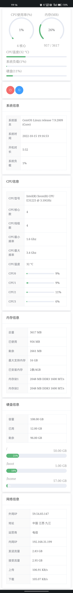

# Centos 监控面板 v1.0

### 开发环境
- Go 1.18 + gin 1.8.1 + websocket 1.5.0 
- Vue 2 + Element UI 2.15.10 (未使用脚手架)

### 功能
- 查看系统信息，负载，开机时长
- 查看CPU信息，占用情况，温度
- 查看内存使用情况
- 查看硬盘容量
- 查看网络使用情况，当前上传下载速率
- 对系统进行关机、重启等操作

### 说明
- 内网使用，没有搞登录，权限验证等，目前只在自己真机(不是虚拟机)上测试过，没得云服务器



### 编译运行
```shell
# 启用 go mod
go env -w GO111MODULE=on
#使用七牛云代理
go env -w GOPROXY=https://goproxy.cn,direct

# go mod init dashboard
go mod tidy

# 编译
go build -o dashboard main.go

# 运行
nohup ./dashboard &
```

http://127.0.0.1:8888/static 

### 常见问题

- 流量无法统计
```shell
# ifconfig 命令不存在，安装 net-tools
yum -y install net-tools
```

- 内存信息无法识别
```shell
# 安装 dmidecode
yum install dmidecode
```

- CPU温度无法识别到
```shell
# 安装 lm_sensors
yum install -y lm_sensors
sensors-detect # 一路 YES
```